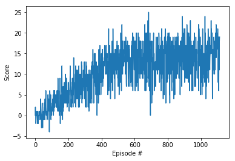
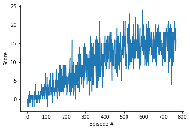
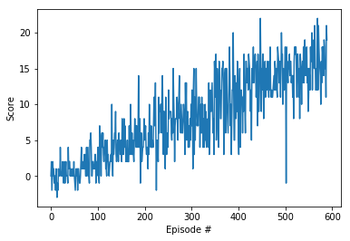
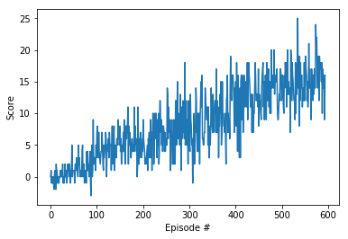

# Navigation Project - Report

The aim of this project is to train an agent to navigate and collect yellow bananas in a large, square world. The task is episodic, and in order to solve the environment, the agent must get an average score of +15 over 100 consecutive episodes.

## Learning Algorithms

Four different variations of the deep Q-learning algorithm are used to solve this environment. 

### Overview of learning algorithms and network architecture

Below is a short summary of the four learning algorithm used to train agents that solve the environment.

#### Deep Q-learning (DQN) 

#### Double Deep Q-learning (DDQN)

#### Dueling Deep Q-learning (Dueling DQN)

#### Dueling Double Deep Q-learning (Dueling DDQN)

Use of soft updates

### Chosen Hyperparameters

## Plot of Rewards

The following plots of the rewards per episode illustrate that the agent is able to receive an average reward (over 100 episodes) of at least +15. The table also shows how many episodes were needed to solve the environment.

<table style="width:100%" border=1>
  <tr>
    <th align=center>Agent: DQN, Solved in: 1013 episodes</th>
    <th align=center>Agent: Double DQN, Solved in: 670 episodes</th> 
  </tr>
  <tr>
    <td align=center></td>
    <td align=center></td>
  </tr>
  <tr>
    <th align=center>Agent: DQN with Dueling, Solved in: 490 episodes</th>
    <th align=center>Agent: Double DQN with Dueling, Solved in: 494 episodes</th>
  </tr>
  <tr>
    <td align=center></td>
    <td align=center></td>
  </tr>
</table>

## Ideas for Future Work

Using a prioritised replay buffer 

